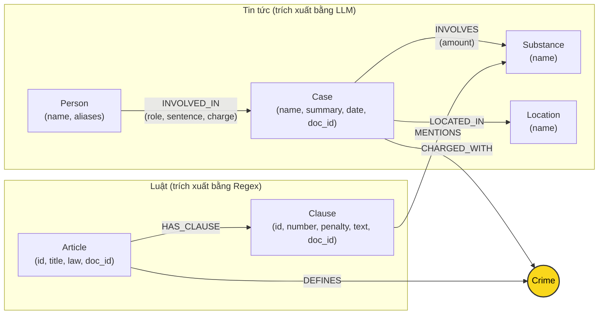

# Thiết kế Ontology — Day 19

**Họ tên:** Nguyễn Phi Nhật  **MSSV:** 2A202602658

**Lựa chọn** (đánh dấu một):
- [x] Dùng ontology gợi ý (có thể chỉnh nhỏ)
- [ ] Tự thiết kế (xét bonus +15, xem `SUBMISSION.md`)

> Hướng dẫn: `LAB_GUIDE.md` Bước 2. Dùng ontology gợi ý thì vẫn phải điền đủ các mục dưới đây bằng lời của bạn.

## 1. Sơ đồ

Sơ đồ Knowledge Graph kết nối 2 cơ sở tri thức (KB Luật và KB Tin tức) qua node cầu nối trung tâm **`Crime`**:

## 2. Entity types (node labels)

| Label | Ý nghĩa | Khóa định danh (`MERGE` theo) | Properties | Lấy từ KB nào | Trích bằng (regex / LLM / khác) |
| --- | --- | --- | --- | --- | --- |
| `Article` | Một Điều luật cụ thể | `id` | `id`, `title`, `law`, `doc_id` | Luật (`data/drug_law/`) | Regex (từ front-matter & tiêu đề file markdown) |
| `Clause` | Một Khoản luật thuộc Điều | `id` | `id`, `number`, `penalty`, `text`, `doc_id` | Luật (`data/drug_law/`) | Regex (tách theo cấu trúc số thứ tự khoản `1.`, `2.`...) |
| `Crime` | Tội danh chuẩn theo luật (node cầu nối) | `name` | `name` | Cả hai KB | Phía luật: regex từ title; Phía tin: LLM + `link_entity` |
| `Case` | Một vụ án / chuyên án ma túy | `name` | `name`, `summary`, `date`, `doc_id`, `source_title` | Tin tức (`data/drug_news/`) | LLM trích xuất có cấu trúc sang JSON |
| `Substance` | Chất ma túy hoặc tiền chất | `name` | `name` | Cả hai KB | Phía luật: regex so khớp từ khóa; Phía tin: LLM trích xuất |
| `Person` | Cá nhân tham gia vụ việc (bị cáo, bị can...) | `name` | `name`, `aliases` | Tin tức (`data/drug_news/`) | LLM trích xuất |
| `Location` | Địa bàn xảy ra vụ việc (tỉnh, thành phố) | `name` | `name` | Tin tức (`data/drug_news/`) | LLM trích xuất |

## 3. Relationships

| Type | Từ → Đến | Properties trên cạnh | Ý nghĩa |
| --- | --- | --- | --- |
| `DEFINES` | `Article` → `Crime` | Không có | Điều luật quy định / định nghĩa tội danh cụ thể |
| `HAS_CLAUSE` | `Article` → `Clause` | Không có | Điều luật bao gồm các khoản luật cấu thành |
| `MENTIONS` | `Clause` → `Substance` | Không có | Khoản luật quy định hình phạt áp dụng cho chất ma túy / tiền chất cụ thể |
| `CHARGED_WITH` | `Case` → `Crime` | Không có | Vụ án bị khởi tố, truy tố hoặc xét xử theo tội danh nào |
| `INVOLVES` | `Case` → `Substance` | `amount` | Tang vật thu giữ trong vụ án thuộc chất gì, khối lượng bao nhiêu |
| `LOCATED_IN` | `Case` → `Location` | Không có | Vụ án xảy ra hoặc được thụ lý, xét xử tại địa phương nào |
| `INVOLVED_IN` | `Person` → `Case` | `role`, `sentence`, `charge` | Cá nhân tham gia vụ án với vai trò gì, tội danh bị quy kết và mức án tuyên phạt |

## 4. Node cầu nối giữa 2 KB

- **Node nào:** Node **`Crime`** (Tội danh, ví dụ: `"mua bán trái phép chất ma túy"`, `"vận chuyển trái phép chất ma túy"`).
- **Vì sao chọn node này:** Bản tin chỉ có thông tin thực tế của vụ án (tên bị cáo, tang vật, mức hình phạt thực tế được tòa tuyên) nhưng không trích đầy đủ văn bản luật hay khung pháp lý chuẩn. Ngược lại, văn bản luật chỉ chứa khung hình phạt trừu tượng theo từng khoản tội danh mà không hề có tên người thật. `Crime` là khái niệm pháp lý xuất hiện bắt buộc ở cả hai phía: Luật quy định tội danh (`Article -[:DEFINES]-> Crime`), và Tin tức ghi nhận hành vi phạm tội của đối tượng (`Case -[:CHARGED_WITH]-> Crime`).
- **Cách đảm bảo hai phía khớp tên:**
  - *Phía luật:* Trích tên tội từ tiêu đề Điều luật, chuẩn hóa bằng `normalize_crime` (bỏ tiền tố `"tội "`, lowercase, gộp khoảng trắng liên tiếp, loại bỏ dấu ngoặc).
  - *Phía tin tức:* Đưa danh sách tội danh chuẩn (`DANH SÁCH TỘI DANH`) vào prompt để hướng LLM chọn đúng nguyên văn.
  - *Hậu xử lý (KG-1):* Hàm `link_entity` chuẩn hóa chuỗi và kiểm tra exact match trước; nếu không khớp exact thì dùng `difflib.get_close_matches(cutoff=0.8)` để sửa các sai lệch chính tả hoặc biến thể dấu tiếng Việt (ví dụ: `"ma tuý"` vs `"ma túy"`).
- **Khi nào cầu gãy, và bạn xử lý thế nào:**
  - *Nguyên nhân gãy (đã kiểm chứng, xem lỗi E1):* khi tội danh trong bài báo **hợp lệ nhưng nằm ngoài 18 điều luật đã nạp**. Ví dụ `news-100260926112415229` về tội *"chống người thi hành công vụ"* (Điều 330 BLHS): LLM trích xuất đúng, nhưng `link_entity` chỉ biết các tội danh **đang có trong graph** nên trả `None`, `charges` thành `[]` và `FOREACH` lặp 0 lần ⇒ không có cạnh `CHARGED_WITH`. Đây là hạn chế **cấu trúc phạm vi dữ liệu**, không phải lỗi của LLM.
  - *Cách xử lý hiện tại:* cầu nối dự phòng thông qua `Substance` (`Case -[:INVOLVES]-> Substance <-[:MENTIONS]- Clause`) **vẫn gãy** trong trường hợp này, vì bài báo ghi `"ma túy"` (tên gọi chung) trong khi `Clause` chỉ `MENTIONS` chất cụ thể — thiếu node khái niệm cấp tổng quát. Thay vào đó, `GraphRAGAgent` giữ lại **top-k chunk văn bản gốc** (hybrid search), nên câu hỏi vẫn trả lời được ở mức mô tả vụ việc dù không suy ra được khung phạt.
  - *Cơ chế xử lý nên có:* lưu tội danh ngoài phạm vi dưới dạng `k.unmapped_charges = [...]` thay vì loại bỏ âm thầm, để tỉ lệ cầu nối gãy trở thành chỉ số đo được và câu hỏi loại "vụ án nào ngoài phạm vi điều luật đã nạp" vẫn trả lời được.

## 5. Competency questions

| Câu | Đường đi (Cypher pattern) | Trả lời được? |
| --- | --- | --- |
| Q1 | `(:Article {law: 'Luật PCMT'})-[:HAS_CLAUSE]->(cl:Clause {number: 4})` | Có (truy vấn khoản 4 Điều 2 định nghĩa tiền chất) |
| Q2 | `(:Person)-[:INVOLVED_IN {sentence: 'tử hình'}]->(:Case)` | Có (lọc các bị cáo có mức án tử hình trong vụ hơn 36kg ma túy) |
| Q3 | `(:Person {name: 'Lê Minh Thành'})-[:INVOLVED_IN]->(:Case)-[:CHARGED_WITH]->(:Crime)<-[:DEFINES]-(:Article)-[:HAS_CLAUSE]->(:Clause {number: 1})` | Có (lấy mức án 36 tháng từ cạnh `INVOLVED_IN`, đi qua Crime sang Điều 251 khoản 1 lấy khung hình phạt 2-7 năm) |
| Q4 | `(:Person)-[:INVOLVED_IN]->(:Case)-[:CHARGED_WITH]->(:Crime)<-[:DEFINES]-(:Article)-[:HAS_CLAUSE]->(:Clause)` | **Có, nhưng không ổn định.** Đường đi chạy được và đáp án đúng (Điều 255, *tổ chức sử dụng*) là *đạt được*, nhưng `context()` nạp cả các điều luật khác có cùng cấu trúc khoản 4 nên LLM phải tự chọn theo thứ tự facts. Thực tế: đúng ở một lần chạy, sai (Điều 249) ở lần chạy trước. Xem lỗi E5. |
| Q5 | `(:Person {name: 'Cái Quang Huy'})-[:INVOLVED_IN]->(k:Case)-[:CHARGED_WITH]->(:Crime)<-[:DEFINES]-(a:Article)-[:HAS_CLAUSE]->(cl:Clause)` kết hợp `(k)-[:INVOLVES]->(s:Substance {name: 'MDMA'})<-[:MENTIONS]-(cl)` | **Không.** Path có đủ nhưng **thiếu thuộc tính quyết định**: ontology không lưu **ngưỡng khối lượng**, nên lọc bằng `cl.number = 4` trả về cả Điều 250 và 251 rồi đẩy xuống cho LLM đoán ⇒ cả hai pipeline đều trả lời Điều 251 thay vì Điều 250. Xem lỗi E5. |
| Q6 | `(:Substance {name: 'MDMA'})<-[:INVOLVES]-(:Case)<-[:INVOLVED_IN]-(:Person)` | Có (truy vấn aggregation gom nhóm tất cả các vụ án và người liên quan đến chất MDMA) |

## 6. Quyết định thiết kế và đánh đổi

1. **Chọn `Crime` làm node cầu nối chính thay vì chỉ dùng `Substance`:**
   - *Đã chọn:* Dùng thực thể `Crime` làm cầu nối giữa `Case` và `Article`.
   - *Phương án khác:* Nối trực tiếp `Case` sang `Clause` thông qua chất ma túy `Substance`.
   - *Lý do & đánh đổi:* Một chất ma túy phổ biến (Heroine, MDMA, Methamphetamine...) xuất hiện trong hầu hết các Điều luật của BLHS (từ Điều 249 tàng trữ, Điều 250 vận chuyển, Điều 251 mua bán, Điều 252 chiếm đoạt...). Nếu chỉ dùng `Substance`, đồ thị sẽ bị bùng nổ đường đi (path explosion) và không thể biết bị cáo bị xét xử về hành vi nào. `Crime` giúp thu hẹp phạm vi chính xác tới đúng Điều luật điều chỉnh.

2. **Mô hình hóa chi tiết đến cấp `Clause` (Khoản) thay vì chỉ dừng ở `Article` (Điều) hoặc đi sâu đến `Point` (Điểm):**
   - *Đã chọn:* Tạo node riêng cho từng `Clause` mang thuộc tính `penalty` và `text`.
   - *Phương án khác:* Chỉ tạo node `Article` lưu toàn văn điều luật, hoặc bóc tách chi tiết từng điểm a, b, c thành node riêng.
   - *Lý do & đánh đổi:* Cấp `Clause` là đơn vị quy định khung hình phạt độc lập (ví dụ khoản 1 là 2-7 năm, khoản 4 là 20 năm, chung thân hoặc tử hình). Dừng ở cấp `Article` thì prompt sẽ phải nhồi toàn bộ văn bản dài gây tốn token và loãng ngữ cảnh. Bóc tách đến cấp `Point` làm số lượng node tăng gấp 4 lần nhưng không mang lại nhiều giá trị vì các điểm trong cùng khoản đều có chung một khung hình phạt.

3. **Lưu `role`, `sentence`, `charge` trực tiếp trên cạnh `INVOLVED_IN` thay vì tạo node `Sentence` hay `Role` riêng:**
   - *Đã chọn:* Lưu thuộc tính trực tiếp trên mối quan hệ giữa `Person` và `Case`.
   - *Phương án khác:* Tạo node `Sentence {type, years}` và node `Role {name}` riêng biệt.
   - *Lý do & đánh đổi:* Giảm độ phức tạp của đồ thị (giảm số node trung gian và số bước nhảy trong Cypher). Các thuộc tính này có tính ngữ cảnh cao: một người trong vụ án này là "bị can", trong vụ án khác là "người liên quan"; mức án gắn liền với từng vụ việc cụ thể. Đánh đổi là không thể dễ dàng chạy truy vấn thống kê toàn cục như "có bao nhiêu người bị phạt tù 15 năm" bằng việc match node Sentence.

## 7. So với ontology gợi ý (bắt buộc nếu xét bonus)

**Bài này chọn phương án dùng ontology gợi ý, không xét bonus +15.** Lý do: sau khi chạy benchmark và soi lỗi, các hạn chế còn lại đều **không phải do chọn sai cấu trúc ontology mà do phạm vi dữ liệu và thiếu mô hình hóa thuộc tính** (xem mục 8). Cụ thể, lỗi E5 (sai điều luật ở Q4/Q5) sẽ **không được sửa** nếu chỉ đổi kiểu quan hệ, vì nguyên nhân là thiếu trường số `threshold_g` trên `Clause` — cần thêm thuộc tính và sửa Cypher, tức là một thay đổi có chủ đích nhưng chưa kịp kiểm chứng bằng benchmark trước/sau trong thời gian của lab. Vì vậy bài nộp theo hướng **đúng mẫu, có bằng chứng đầy đủ** thay vì mạo hiểm trên phần bonus.

| Điểm khác | Gợi ý làm gì | Bạn làm gì | Vấn đề nó giải quyết | Bằng chứng (Cypher, hoặc số liệu benchmark) |
| --- | --- | --- | --- | --- |
| *(giữ nguyên theo ontology gợi ý — xem lý do ở trên)* | | | | |

> **Ghi chú phục vụ người chấm:** các hạn chế ở mục 8 chính là những hướng nâng cấp có thể dùng để biến ontology gợi ý thành ontology tự thiết kế đủ điều kiện bonus, kèm Cypher trước/sau.

## 8. Hạn chế còn lại

Các hạn chế dưới đây được phát hiện bằng bằng chứng cụ thể trong `report/REPORT_KG.md` mục 3, không phải suy đoán.

- **Phạm vi KB luật hẹp hơn phạm vi thực tế của KB tin tức, gây cầu nối gãy âm thầm (E1):** KB luật chỉ gồm 13 Điều Chương XX BLHS + 5 Điều Luật PCMT, trong khi bài báo `news-100260926112415229` nói về tội *"chống người thi hành công vụ"* (Điều 330 BLHS). LLM trích ra đúng tội danh đó, nhưng `link_entity` chỉ liên kết vào danh sách tội danh **đang có trong graph**, nên trả `None` và báo cáo bỏ trống — node `Case` rơi vào mồ côi mà **không có tín hiệu cảnh báo nào**. Ontology thiếu một khái niệm cho tội danh ngoài phạm vi.
- **Cầu nối dự phòng qua `Substance` không hoạt động do thiếu khái niệm cấp tổng quát (E1):** cùng vụ án này có `INVOLVES -> "ma túy"` — nhưng đó là tên gọi chung, trong khi `Clause` chỉ `MENTIONS` các chất cụ thể (Heroine, MDMA...). Không có node khái niệm chung nối hai cấp này nên cầu nối dự phòng cũng gãy.
- **Thiếu mô hình hóa ngưỡng khối lượng, dẫn tới trả lời sai điều luật (E5):** 13 Điều của Chương XX đều có khoản 4 với cùng câu chữ "tù 20 năm, tù chung thân hoặc tử hình", và chính ngưỡng khối lượng (ví dụ Điều 250 khoản 4 điểm b: MDMA ≥ 100 gam) mới quyết định khoản nào được áp dụng. Ontology chỉ lưu `number` và `penalty` dạng văn bản, không có trường số, nên `context()` chỉ lọc được bằng tiêu chí hình thức (`cl.number = 4`) và trả về cả Điều 250 lẫn 251 cùng lúc. Hệ quả quan sát được: Q5 trả lời Điều 251 thay vì Điều 250.
- **Thứ tự facts là tín hiệu ngẫu nhiên, không mang thông tin pháp lý (E5):** khi Cypher trả về nhiều ứng viên cùng thoả điều kiện, LLM chỉ còn căn cứ **thứ tự xuất hiện** để quyết định. Thứ tự đó đến từ thứ tự `MATCH` trả về, không có tính pháp lý. Bằng chứng: Q4 trả lời đúng Điều 255 ở một lần chạy và sai Điều 249 ở lần chạy trước, dù cùng code và `temperature=0`. Nếu ontology định nghĩa được **thứ tự ưu tiên** (ví dụ theo mức nghiêm khắc của `penalty`) thì tín hiệu này mới có ích.
- **Tội danh gắn ở cấp `Case` thay vì ở cấp hành vi của từng người (E5):** một vụ án có thể có nhiều tội danh, và câu hỏi về một người cụ thể bị buộc phải chọn giữa tất cả tội danh của cả vụ. Trong khi `INVOLVED_IN` đã mang sẵn `r.charge`, nhưng Cypher của `context()` không dùng nó để giới hạn theo người được hỏi. Ontology **có** property đúng chỗ nhưng **query** chưa tận dụng — đây là hạn chế của KG-3 chứ không phải của thiết kế ontology.
- **Trùng thực thể chất ma túy (E3):** `CONSTRAINT ... REQUIRE n.name IS UNIQUE` phân biệt hoa/thường, nên tồn tại song song `Ketamine`/`ketamine` và `Methamphetamine`/`methamphetamine`; tên lóng `thuốc lắc` cũng tách riêng khỏi `MDMA`. Thiếu tầng chuẩn hóa + từ điển đồng nghĩa trước khi `MERGE`.
- **Trùng thực thể do LLM đặt tên:** khóa định danh của `Case` dựa trên tên do LLM tự sinh, nên cùng một chuyên án có thể sinh nhiều node (ví dụ các bài báo khác nhau về *"Hoàng Nato"* đều dẫn về cùng một chuyên án). Chưa có khóa nào ổn định theo thực thể ngoài đời.
