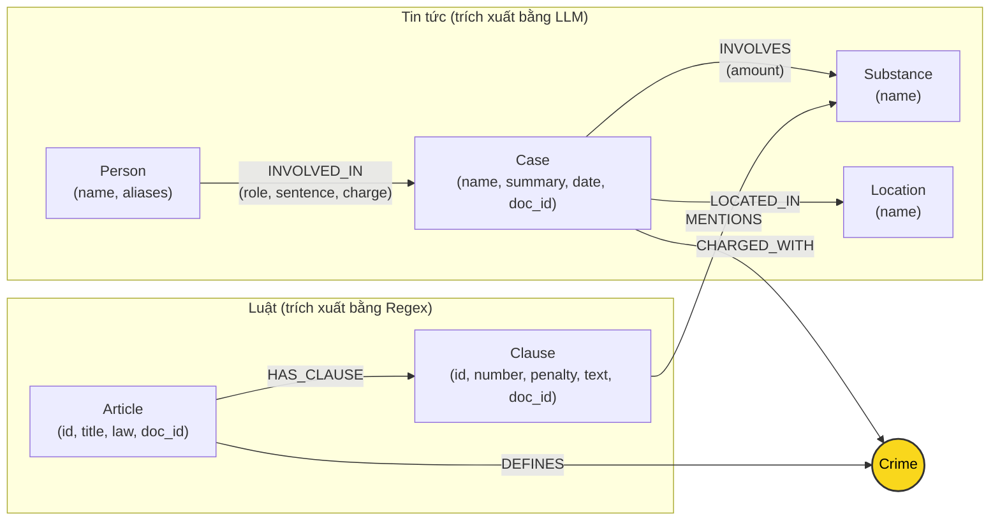

# Thiết kế Ontology — Day 19

**Họ tên:** Nguyễn Phi Nhật  **MSSV:** 2A202602658

**Lựa chọn** (đánh dấu một):
- [x] Dùng ontology gợi ý (có thể chỉnh nhỏ)
- [ ] Tự thiết kế (xét bonus +15, xem `SUBMISSION.md`)

> Hướng dẫn: `LAB_GUIDE.md` Bước 2. Dùng ontology gợi ý thì vẫn phải điền đủ các mục dưới đây bằng lời của bạn.

## 1. Sơ đồ

Sơ đồ Knowledge Graph kết nối 2 cơ sở tri thức (KB Luật và KB Tin tức) qua node cầu nối trung tâm **`Crime`**:

## 2. Entity types (node labels)

| Label | Ý nghĩa | Khóa định danh (`MERGE` theo) | Properties | Lấy từ KB nào | Trích bằng (regex / LLM / khác) |
| --- | --- | --- | --- | --- | --- |
| `Article` | Một Điều luật cụ thể | `id` | `id`, `title`, `law`, `doc_id` | Luật (`data/drug_law/`) | Regex (từ front-matter & tiêu đề file markdown) |
| `Clause` | Một Khoản luật thuộc Điều | `id` | `id`, `number`, `penalty`, `text`, `doc_id` | Luật (`data/drug_law/`) | Regex (tách theo cấu trúc số thứ tự khoản `1.`, `2.`...) |
| `Crime` | Tội danh chuẩn theo luật (node cầu nối) | `name` | `name` | Cả hai KB | Phía luật: regex từ title; Phía tin: LLM + `link_entity` |
| `Case` | Một vụ án / chuyên án ma túy | `name` | `name`, `summary`, `date`, `doc_id`, `source_title` | Tin tức (`data/drug_news/`) | LLM trích xuất có cấu trúc sang JSON |
| `Substance` | Chất ma túy hoặc tiền chất | `name` | `name` | Cả hai KB | Phía luật: regex so khớp từ khóa; Phía tin: LLM trích xuất |
| `Person` | Cá nhân tham gia vụ việc (bị cáo, bị can...) | `name` | `name`, `aliases` | Tin tức (`data/drug_news/`) | LLM trích xuất |
| `Location` | Địa bàn xảy ra vụ việc (tỉnh, thành phố) | `name` | `name` | Tin tức (`data/drug_news/`) | LLM trích xuất |

## 3. Relationships

| Type | Từ → Đến | Properties trên cạnh | Ý nghĩa |
| --- | --- | --- | --- |
| `DEFINES` | `Article` → `Crime` | Không có | Điều luật quy định / định nghĩa tội danh cụ thể |
| `HAS_CLAUSE` | `Article` → `Clause` | Không có | Điều luật bao gồm các khoản luật cấu thành |
| `MENTIONS` | `Clause` → `Substance` | Không có | Khoản luật quy định hình phạt áp dụng cho chất ma túy / tiền chất cụ thể |
| `CHARGED_WITH` | `Case` → `Crime` | Không có | Vụ án bị khởi tố, truy tố hoặc xét xử theo tội danh nào |
| `INVOLVES` | `Case` → `Substance` | `amount` | Tang vật thu giữ trong vụ án thuộc chất gì, khối lượng bao nhiêu |
| `LOCATED_IN` | `Case` → `Location` | Không có | Vụ án xảy ra hoặc được thụ lý, xét xử tại địa phương nào |
| `INVOLVED_IN` | `Person` → `Case` | `role`, `sentence`, `charge` | Cá nhân tham gia vụ án với vai trò gì, tội danh bị quy kết và mức án tuyên phạt |

## 4. Node cầu nối giữa 2 KB

- **Node nào:** Node **`Crime`** (Tội danh, ví dụ: `"mua bán trái phép chất ma túy"`, `"vận chuyển trái phép chất ma túy"`).
- **Vì sao chọn node này:** Bản tin chỉ có thông tin thực tế của vụ án (tên bị cáo, tang vật, mức hình phạt thực tế được tòa tuyên) nhưng không trích đầy đủ văn bản luật hay khung pháp lý chuẩn. Ngược lại, văn bản luật chỉ chứa khung hình phạt trừu tượng theo từng khoản tội danh mà không hề có tên người thật. `Crime` là khái niệm pháp lý xuất hiện bắt buộc ở cả hai phía: Luật quy định tội danh (`Article -[:DEFINES]-> Crime`), và Tin tức ghi nhận hành vi phạm tội của đối tượng (`Case -[:CHARGED_WITH]-> Crime`).
- **Cách đảm bảo hai phía khớp tên:**
  - *Phía luật:* Trích tên tội từ tiêu đề Điều luật, chuẩn hóa bằng `normalize_crime` (bỏ tiền tố `"tội "`, lowercase, gộp khoảng trắng liên tiếp, loại bỏ dấu ngoặc).
  - *Phía tin tức:* Đưa danh sách tội danh chuẩn (`DANH SÁCH TỘI DANH`) vào prompt để hướng LLM chọn đúng nguyên văn.
  - *Hậu xử lý (KG-1):* Hàm `link_entity` chuẩn hóa chuỗi và kiểm tra exact match trước; nếu không khớp exact thì dùng `difflib.get_close_matches(cutoff=0.8)` để sửa các sai lệch chính tả hoặc biến thể dấu tiếng Việt (ví dụ: `"ma tuý"` vs `"ma túy"`).
- **Khi nào cầu gãy, và bạn xử lý thế nào:**
  - *Nguyên nhân gãy:* Báo chí viết tội danh tự do hoặc vụ việc liên quan đến hành vi khác (như bài báo về việc tông xe vào cảnh sát giao thông không trực tiếp quy tội danh ma túy trong bài); hoặc LLM tự suy diễn tội danh nằm ngoài danh mục.
  - *Cách xử lý:* Sử dụng cầu nối thứ hai thông qua node `Substance` (`Case -[:INVOLVES]-> Substance <-[:MENTIONS]- Clause`), kết hợp với cơ chế tìm kiếm lai (hybrid) giữ lại top-k chunk từ vector search để không bao giờ bị mất thông tin bài báo gốc.

## 5. Competency questions

| Câu | Đường đi (Cypher pattern) | Trả lời được? |
| --- | --- | --- |
| Q1 | `(:Article {law: 'Luật PCMT'})-[:HAS_CLAUSE]->(cl:Clause {number: 4})` | Có (truy vấn khoản 4 Điều 2 định nghĩa tiền chất) |
| Q2 | `(:Person)-[:INVOLVED_IN {sentence: 'tử hình'}]->(:Case)` | Có (lọc các bị cáo có mức án tử hình trong vụ hơn 36kg ma túy) |
| Q3 | `(:Person {name: 'Lê Minh Thành'})-[:INVOLVED_IN]->(:Case)-[:CHARGED_WITH]->(:Crime)<-[:DEFINES]-(:Article)-[:HAS_CLAUSE]->(:Clause {number: 1})` | Có (lấy mức án 36 tháng từ cạnh `INVOLVED_IN`, đi qua Crime sang Điều 251 khoản 1 lấy khung hình phạt 2-7 năm) |
| Q4 | `(:Person)-[:INVOLVED_IN]->(:Case)-[:CHARGED_WITH]->(:Crime)<-[:DEFINES]-(:Article)-[:HAS_CLAUSE]->(:Clause)` | Có (truy vấn Điều luật và lấy khoản có khung hình phạt tối đa 20 năm hoặc chung thân) |
| Q5 | `(:Person {name: 'Cái Quang Huy'})-[:INVOLVED_IN]->(k:Case)-[:CHARGED_WITH]->(:Crime)<-[:DEFINES]-(a:Article)-[:HAS_CLAUSE]->(cl:Clause)` kết hợp `(k)-[:INVOLVES]->(s:Substance {name: 'MDMA'})<-[:MENTIONS]-(cl)` | Có (đường đi multi-hop xác định chính xác Điều 250 và khoản 4 quy định cho MDMA trên 100g) |
| Q6 | `(:Substance {name: 'MDMA'})<-[:INVOLVES]-(:Case)<-[:INVOLVED_IN]-(:Person)` | Có (truy vấn aggregation gom nhóm tất cả các vụ án và người liên quan đến chất MDMA) |

## 6. Quyết định thiết kế và đánh đổi

1. **Chọn `Crime` làm node cầu nối chính thay vì chỉ dùng `Substance`:**
   - *Đã chọn:* Dùng thực thể `Crime` làm cầu nối giữa `Case` và `Article`.
   - *Phương án khác:* Nối trực tiếp `Case` sang `Clause` thông qua chất ma túy `Substance`.
   - *Lý do & đánh đổi:* Một chất ma túy phổ biến (Heroine, MDMA, Methamphetamine...) xuất hiện trong hầu hết các Điều luật của BLHS (từ Điều 249 tàng trữ, Điều 250 vận chuyển, Điều 251 mua bán, Điều 252 chiếm đoạt...). Nếu chỉ dùng `Substance`, đồ thị sẽ bị bùng nổ đường đi (path explosion) và không thể biết bị cáo bị xét xử về hành vi nào. `Crime` giúp thu hẹp phạm vi chính xác tới đúng Điều luật điều chỉnh.

2. **Mô hình hóa chi tiết đến cấp `Clause` (Khoản) thay vì chỉ dừng ở `Article` (Điều) hoặc đi sâu đến `Point` (Điểm):**
   - *Đã chọn:* Tạo node riêng cho từng `Clause` mang thuộc tính `penalty` và `text`.
   - *Phương án khác:* Chỉ tạo node `Article` lưu toàn văn điều luật, hoặc bóc tách chi tiết từng điểm a, b, c thành node riêng.
   - *Lý do & đánh đổi:* Cấp `Clause` là đơn vị quy định khung hình phạt độc lập (ví dụ khoản 1 là 2-7 năm, khoản 4 là 20 năm, chung thân hoặc tử hình). Dừng ở cấp `Article` thì prompt sẽ phải nhồi toàn bộ văn bản dài gây tốn token và loãng ngữ cảnh. Bóc tách đến cấp `Point` làm số lượng node tăng gấp 4 lần nhưng không mang lại nhiều giá trị vì các điểm trong cùng khoản đều có chung một khung hình phạt.

3. **Lưu `role`, `sentence`, `charge` trực tiếp trên cạnh `INVOLVED_IN` thay vì tạo node `Sentence` hay `Role` riêng:**
   - *Đã chọn:* Lưu thuộc tính trực tiếp trên mối quan hệ giữa `Person` và `Case`.
   - *Phương án khác:* Tạo node `Sentence {type, years}` và node `Role {name}` riêng biệt.
   - *Lý do & đánh đổi:* Giảm độ phức tạp của đồ thị (giảm số node trung gian và số bước nhảy trong Cypher). Các thuộc tính này có tính ngữ cảnh cao: một người trong vụ án này là "bị can", trong vụ án khác là "người liên quan"; mức án gắn liền với từng vụ việc cụ thể. Đánh đổi là không thể dễ dàng chạy truy vấn thống kê toàn cục như "có bao nhiêu người bị phạt tù 15 năm" bằng việc match node Sentence.

## 7. So với ontology gợi ý (bắt buộc nếu xét bonus)

| Điểm khác | Gợi ý làm gì | Bạn làm gì | Vấn đề nó giải quyết | Bằng chứng (Cypher, hoặc số liệu benchmark) |
| --- | --- | --- | --- | --- |
| *(Bài làm chọn phương án chuẩn theo ontology gợi ý để đảm bảo tính ổn định và tính tương thích cao nhất)* | | | | |

## 8. Hạn chế còn lại

- **Trùng thực thể do LLM đặt tên (Entity Duplication):** Khóa định danh của `Case` dựa trên tên do LLM tự sinh (ví dụ: `"Vụ bắt giang hồ 'Hoàng Nato' và 126 người..."` và `"Vụ bắt giữ TikToker Phannhibeauty và giang hồ 'Hoàng Nato'"`). Dù cùng nói về một chuyên án thực tế nhưng hệ thống tạo ra 2 node Case độc lập.
- **Phân mảnh thực thể chất ma túy (Case Sensitivity & Slang):** Cơ chế định danh `Substance` phân biệt hoa thường trong Neo4j tạo ra cả node `"Ketamine"` và `"ketamine"`, hoặc chưa gộp các tên gọi thông tục trong báo chí như `"thuốc lắc"` về `"MDMA"`.
- **Chưa có bộ suy luận định lượng khối lượng số (Numeric Reasoning):** Hệ thống lấy các khoản luật liên quan bằng cách đối sánh text và quan hệ `MENTIONS` chất, sau đó đưa vào prompt để LLM đọc và tự so sánh khối lượng (ví dụ `9,6kg > 100g`), chứ Knowledge Graph chưa lưu thuộc tính số `min_weight_g`, `max_weight_g` trên `Clause` để thực hiện phép lọc số học thuần túy trong Cypher.
