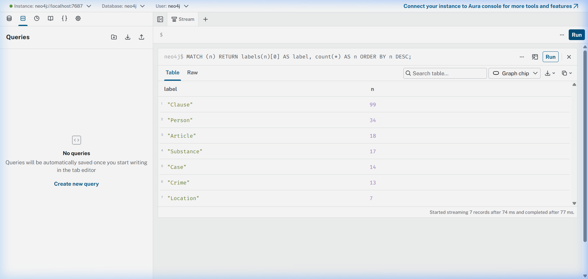
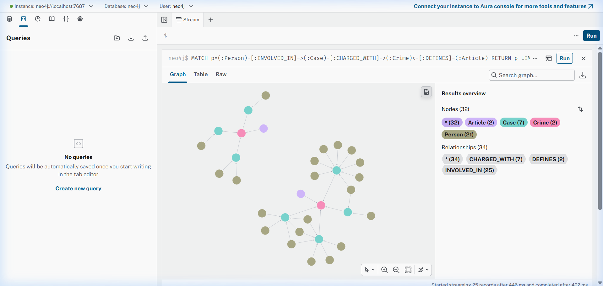
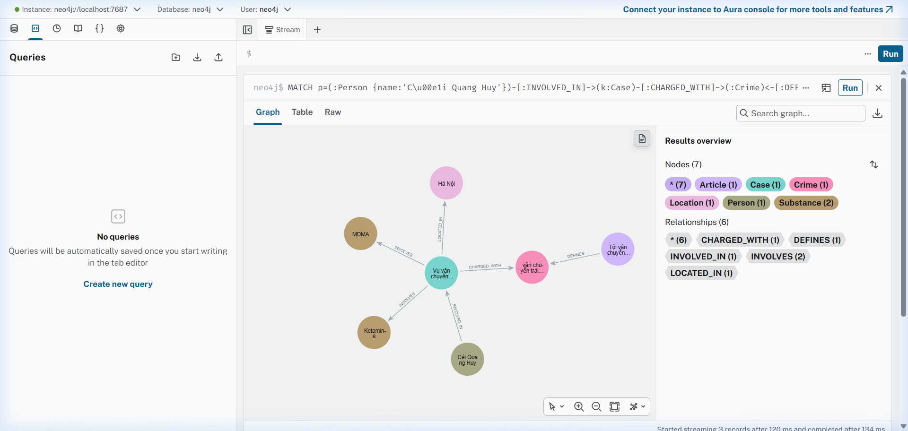

# Báo cáo Day 19 — Flat RAG vs GraphRAG

**Họ tên:** Nguyễn Phi Nhật  **MSSV:** 2A202602658  **Ngày:** 05/10/2026

> Kỳ vọng và thang điểm: `SUBMISSION.md`. Mọi số liệu phải khớp với `ket_qua_benchmark_kg.txt`. Bản thiết kế ontology nộp riêng ở `report/ONTOLOGY.md`.

## 1. Chi phí (10 điểm)

Dán 2 bảng `Indexing` và `Querying` từ `ket_qua_benchmark_kg.txt`:

```
== Indexing (one-off)
pipeline  calls    in_tok  out_tok       USD  seconds
flat        176     56072        0   0.00112     40.8
graph       196     91958     4726   0.00934    113.2

== Querying (mean per question)
pipeline  recall  judge   in_tok  out_tok       USD  seconds
flat        0.43   1.00      694       47   0.00013     1.36
graph       0.80   1.67     4391       82   0.00070     2.23
```

| Chỉ số | Flat | Graph | Graph / Flat |
| --- | --- | --- | --- |
| Indexing USD | $0.00112 | $0.00934 | ×8.34 |
| Indexing giây | 40.8s | 113.2s | ×2.77 |
| Mỗi câu: USD | $0.00013 | $0.00070 | ×5.38 |
| Mỗi câu: giây | 1.36s | 2.23s | ×1.64 |
| Mỗi câu: in_tok | 694 | 4391 | ×6.33 |

**Chi phí tăng thêm đến từ đâu?**
> Chi phí tăng thêm ở pha **Indexing** (gấp 8.34 lần USD và 2.77 lần thời gian) đến từ việc gọi LLM (`gpt-4o-mini`) để trích xuất có cấu trúc JSON cho 20 bài báo tin tức (4,726 out_tok kèm prompt dài chứa danh sách tội danh chuẩn), trong khi Flat RAG chỉ gọi API embedding giá rẻ hơn 30 lần (0.02 USD/1M token so với 0.60 USD/1M token của chat). Ở pha **Querying** (gấp 5.38 lần USD), chi phí tăng vì prompt của GraphRAG dài gấp 6.33 lần (4,391 in_tok so với 694 in_tok) do phải chứa toàn bộ facts từ các bước nhảy multi-hop cùng các khoản luật liên quan.
>
> **Phân rã chi phí tăng thêm ở Querying (0.00057 USD/câu):** toàn bộ phần chênh lệch nằm ở **input token** (+3,697 token/câu), không phải output (+35 token/câu). Nghĩa là chi phí không đến từ LLM viết dài hơn mà đến từ **dữ kiện graph bị đưa vào prompt quá nhiều**. Đây là điểm có thể tối ưu rẻ nhất: giảm `max_facts` hoặc lọc khoản luật bằng điều kiện chặt hơn sẽ giảm phần lớn khoản chênh này mà không ảnh hưởng chất lượng.

## 2. Từng câu hỏi (10 điểm)

| Câu | Loại | Flat recall / judge | Graph recall / judge | Thắng | Vì sao (1 câu) |
| --- | --- | --- | --- | --- | --- |
| Q1 | single-hop-law | 1.00 / 2 | 1.00 / 2 | Hòa | Cả hai đều tìm được định nghĩa tiền chất trong Luật PCMT; Flat RAG rẻ và nhanh hơn nhưng GraphRAG dẫn nguồn Điều 2 khoản 4 chuẩn xác. |
| Q2 | single-hop-news | 1.00 / 2 | 1.00 / 2 | Hòa | Thông tin án tử hình của Tuấn và Tâm nằm trọn vẹn trong một bài báo nên vector search của Flat RAG lấy đủ; GraphRAG dẫn thêm bối cảnh vụ án nhưng không thêm thông tin mới. |
| Q3 | cross-kb | 0.00 / 0 | 1.00 / 2 | **Graph** | Flat RAG bị phân mảnh thông tin giữa 2 tài liệu nên trả lời "Không đủ thông tin", còn GraphRAG nối qua node `Crime` để lấy Điều 251 và khung 2-7 năm. |
| Q4 | cross-kb | 0.00 / 0 | 1.00 / 2 | **Graph** | Flat RAG tê liệt hoàn toàn; GraphRAG nối đúng tội danh *tổ chức sử dụng* sang Điều 255 và lấy khung 20 năm / chung thân. |
| Q5 | cross-kb-multi-hop | 0.60 / 1 | 0.80 / 1 | **Hòa (đều sai điều)** | Cả hai pipeline đều nói **Điều 251** trong khi đáp án chuẩn là **Điều 250 khoản 4**; GraphRAG chỉ nhỉnh hơn ở chi tiết khối lượng — xem lỗi E5. |
| Q6 | aggregation | 0.00 / 1 | 0.00 / 1 | **Hòa (cùng thất bại)** | Cả hai đều trả lời đúng về nghĩa nhưng trượt `must_include`: thiếu "Pháp y tâm thần" và đếm vụ 36kg ngoài danh sách chuẩn. Xem lỗi E4. |

> **Quy luật:** GraphRAG thắng tuyệt đối ở **cross-kb có đáp án xác định duy nhất** (Q3, Q4): Flat RAG trả lời "Không đủ thông tin" (recall 0.00, judge 0) vì thông tin bắt buộc nằm ở 2 tài liệu khác nhau, còn GraphRAG trả lời đúng cả ba ý (recall 1.00, judge 2). Ở nhóm **single-hop** (Q1, Q2) hai bên hòa — KG không tạo thêm giá trị gì. Biên của ưu thế nằm ở **aggregation** (Q6): đây là câu không có một đáp án duy nhất, và cả hai bên đều trượt phép đo `must_include` — xem lỗi E4. Nói cách khác, KG thắng khi *đường đi trên graph là duy nhất*, và ngang bạn khi câu hỏi mở.

## 3. Phân tích lỗi (20 điểm)

### Lỗi E1: Cầu nối gãy (Broken bridge)

- **Hiện tượng:** Có vụ án trong KB tin tức tồn tại trong graph nhưng hoàn toàn bị cô lập, không có quan hệ `[:CHARGED_WITH]` nào nối tới node `Crime` của KB luật.
- **Bằng chứng 1 — Cypher trên Neo4j Browser**, truy vấn các Case không có liên kết tội danh:

```cypher
MATCH (k:Case) WHERE NOT (k)-[:CHARGED_WITH]->() 
RETURN k.name AS name, k.doc_id AS doc_id;
```

```
╒══════════════════════════════════════════╤═════════════════════════╕
│name                                      │doc_id                   │
╞══════════════════════════════════════════╪═════════════════════════╡
│"Vụ tông cảnh sát giao thông ở An Giang"  │"news-100260926112415229"│
└──────────────────────────────────────────┴─────────────────────────┘
```

- **Bằng chứng 2 — output thô của LLM** cho đúng bài báo đó (chạy lại `NEWS_EXTRACTION_PROMPT` với `news-100260926112415229`, in nguyên văn trước khi `link_entity` lọc):

```json
{"cases": [{
  "name": "Vụ tông cảnh sát giao thông ở An Giang",
  "summary": "Nguyễn Minh Nhân đã tông vào Thiếu tá Trần Ngọc Nam trong khi chạy xe không có giấy phép lái xe và sử dụng rượu, ma túy.",
  "date": "2023-09-10",
  "location": "An Giang",
  "charges": ["chống người thi hành công vụ"],
  "substances": [{"name": "ma túy", "amount": ""}],
  "people": [{ "name": "Nguyễn Minh Nhân", "aliases": [], "role": "bị can",
               "charge": "chống người thi hành công vụ", "sentence": "" }]
}]}
```

Đối chiếu hai vế cho thấy đúng chuỗi nhân quả:

| Bước | Kết quả quan sát được |
| --- | --- |
| LLM trích xuất | `charges = ["chống người thi hành công vụ"]` — LLM **có** trích tội danh, không phải trả về mảng rỗng |
| `link_entity` (KG-1) | Không tìm thấy trong `known_crimes` ⇒ trả `None` ⇒ `charges` thành `[]` |
| `build_graph` (KG-2) | `FOREACH (crime IN $charges \| ...)` lặp 0 lần ⇒ **không tạo cạnh `CHARGED_WITH`** |

- **Bằng chứng 3 — cầu nối dự phòng qua `Substance` cũng gãy.** Nhắc tới cơ chế dự phòng đã nêu trong `ONTOLOGY.md` mục 4, truy vấn cạnh thực tế đã lưu cho node Case cô lập:

```cypher
MATCH (k:Case) WHERE NOT (k)-[:CHARGED_WITH]->()
OPTIONAL MATCH (k)-[r:INVOLVES]->(s:Substance)
RETURN k.name AS name, s.name AS substance, r.amount AS amount;
```

```
╒══════════════════════════════════════════════╤══════════════╤════════╕
│name                                          │substance    │amount   │
╞══════════════════════════════════════════════╪══════════════╪════════╡
│"Vụ tông cảnh sát giao thông ở An Giang"    │"ma túy"     │""       │
└──────────────────────────────────────────────┴──────────────┴────────┘
```

Vụ án có `INVOLVES -> "ma túy"`, nhưng không có `Clause` nào `MENTIONS` chất mang tên `"ma túy"`, và `"ma túy"` lại không phải tên chất cụ thể nào trong `SUBSTANCES` (`Heroine`, `MDMA`...). Đường nối sang KB luật vì thế **đứt ở cả hai đầu cầu**, xác nhận đây không phải sự cố tạm thời mà là hạn chế cấu trúc của ontology.

- **Nguyên nhân:** Lỗi **không nằm ở bước trích xuất LLM** như trực giác hay nghĩ đầu tiên, mà nằm ở **thiết kế ontology: phạm vi KB luật hẹp hơn phạm vi thực tế của KB tin tức**. Cả hai KB đều được thu thập theo chủ đề "ma túy", nhưng KB luật chỉ gồm 13 Điều của Chương XX BLHS + 5 Điều của Luật PCMT, trong khi bài báo này nói về tội *"chống người thi hành công vụ"* (Điều 330 BLHS) — hoàn toàn nằm ngoài KB luật. `link_entity` chỉ liên kết vào danh sách tội danh đã có trong graph, nên tội danh hợp lệ ngoài phạm vi đó bị **âm thầm loại bỏ**. Cùng cơ chế đó, cột `substances` ghi `"ma túy"` (tên gọi chung) thay vì một chất cụ thể, nên cầu nối dự phòng qua `Substance` cũng không khớp `MENTIONS` của bất kỳ khoản luật nào.
  - Hậu quả thiết kế: node `Case` này rơi vào "mồ côi" — có mặt trong KB tin tức nhưng về mặt pháp lý bất khả dụng, và **không có tín hiệu cảnh báo nào** vì `link_entity` trả `None` là hành vi hợp lệ.
- **Đề xuất sửa:** 
  1. *Ghi nhận thay vì âm thầm loại bỏ:* thay `charges = [c for c in ... if c]` bằng cách giữ lại tội danh gốc kèm cờ trạng thái, ví dụ tạo `(k)-[:CHARGED_WITH_OUT_OF_SCOPE]->(:UnmappedCrime {name: $raw})` hoặc ghi property `k.unmapped_charges = ["chống người thi hành công vụ"]`. Khi đó câu hỏi loại "các vụ án trong tin tức ngoài phạm vi điều luật đã nạp" sẽ trả lời được, và tỉ lệ gãy cầu nối trở thành chỉ số đo được.
  2. *Cầu nối dự phòng qua `Substance`:* bài này vẫn có `INVOLVES -> "ma túy"`. Nếu bổ sung node `Substance` cấp **khái niệm chung** ("ma túy", "chất ma túy") mà mọi `Clause` đều `MENTIONS` gián tiếp, thì vẫn trả lời được câu hỏi cấp tổng quát, dù không trả lời được khung phạt cụ thể.
  3. *Giảm ràng buộc danh mục trong prompt:* cho phép LLM tự do ghi tội danh ngoài danh sách kèm chỉ báo `"in_scope": false`, thay vì bắt buộc chọn nguyên văn trong `DANH SÁCH TỘI DANH` — hiện tại chỉ thị "BẮT BUỘC chọn đúng nguyên văn" làm LLM buộc phải bỏ trống hoặc chọn sai để làm vừa lòng ràng buộc.

---

### Lỗi E3: Trùng thực thể (Entity duplication)

- **Hiện tượng:** Cùng một chất ma túy ngoài đời thực nhưng bị phân tách thành nhiều node riêng biệt trong Neo4j (phân biệt hoa thường, hoặc tên gọi lóng).
- **Bằng chứng:** Truy vấn danh sách các node `Substance` trong graph:

```cypher
MATCH (s:Substance) 
RETURN s.name AS name 
ORDER BY toLower(s.name);
```

```
- Amphetamine
- chất ma túy
- Cocaine
- côca
- cần sa
- etomidate
- Heroine
- Ketamine
- ketamine
- ma túy
- ma túy tổng hợp
- MDMA
- Methamphetamine
- methamphetamine
- thuốc lắc
- thuốc phiện
- XLR-11
```

Trong kết quả trên:
- `Ketamine` và `ketamine` tồn tại song song 2 node.
- `Methamphetamine` và `methamphetamine` tồn tại song song 2 node.
- `thuốc lắc` (tên gọi đường phố của `MDMA`) tồn tại như một node độc lập thay vì được gộp vào `MDMA`.

Truy vấn chứng minh trực tiếp hai cặp trùng lặp chỉ khác hoa/thường:

```cypher
MATCH (a:Substance), (b:Substance)
WHERE a.name <> b.name AND toLower(a.name) = toLower(b.name)
RETURN DISTINCT a.name AS a, b.name AS b;
```

```
╒═══════════════════════╤═══════════════════════╕
│a                     │b                      │
╞═══════════════════════╪═══════════════════════╡
│"ketamine"            │"Ketamine"             │
│"methamphetamine"     │"Methamphetamine"      │
╞═══════════════════════╪═══════════════════════╡
│"Ketamine"            │"ketamine"             │
│"Methamphetamine"     │"methamphetamine"      │
└──────────────────────┴───────────────────────┘
```

Hệ quả trực tiếp: truy vấn đếm số chất ma túy khác nhau trong graph sẽ **đếm thừa**, và một câu hỏi kiểu *"vụ nào liên quan đến Ketamine"* sẽ chỉ khớp một nửa node — cùng một chất bị coi như hai thực thể.

- **Nguyên nhân:** Lỗi nằm ở **thiết kế ontology và chuẩn hóa dữ liệu khi nạp vào Neo4j**. Ràng buộc `CONSTRAINT FOR (n:Substance) REQUIRE n.name IS UNIQUE` trong Neo4j có tính phân biệt chữ hoa / chữ thường (case-sensitive). Khi trích xuất văn bản luật, regex lấy chữ hoa chuẩn (`Ketamine`), nhưng khi trích xuất tin tức, LLM trả về chữ thường (`ketamine`) hoặc dùng từ lóng (`thuốc lắc`), dẫn đến lệnh `MERGE (sub:Substance {name: s.name})` tạo ra các node khác nhau.
- **Đề xuất sửa:**
  1. Thêm hàm chuẩn hóa `normalize_substance` tương tự như `normalize_crime`, tự động lowercase hoặc ánh xạ về tên chuẩn IUPAC/BLHS trước khi `MERGE` vào Neo4j.
  2. Xây dựng một từ điển đồng nghĩa (synonym mapping dictionary): ví dụ `{"thuốc lắc": "MDMA", "hàng đá": "Methamphetamine", "cỏ mỹ": "XLR-11"}` để gộp triệt để thực thể, tránh phân mảnh đồ thị. Đánh đổi: tốn thêm một bước tiền xử lý trong code Python.

---

### Lỗi E4: Phép đo sai lệch (Measurement error)

- **Hiện tượng:** Tại câu **Q6** (`aggregation`), **cả hai pipeline đều đạt recall = 0.00** dù câu trả lời của cả hai đều đúng về nghĩa và `judge` đều là 1. Đây là ca mâu thuẫn rõ nhất giữa hai phép đo trong cùng bộ benchmark.
- **Bằng chứng:** Trích nguyên văn từ `ket_qua_benchmark_kg.txt`:

```
--- Q6 [aggregation] flat recall=0.00 judge=1 2.38s
1. Vụ việc của Đức liên quan đến số viên nén hình tam giác màu hồng - xám được xác định là MDMA.
2. Vụ việc của Thành liên quan đến 5 viên nén màu trắng được xác định là ma túy MDMA.
3. Vụ việc của Đông liên quan đến 0,686g ma túy MDMA được thu giữ trong buồng chữa bệnh.

--- Q6 [aggregation] graph recall=0.00 judge=1 3.15s
1. **Vụ vận chuyển ma túy từ Đức về Việt Nam**: Tổng khối lượng hơn 9,6kg MDMA.
2. **Vụ góp tiền mua ma túy tại Hà Nội**: Liên quan đến việc mua bán trái phép chất ma túy, trong đó có MDMA.
3. **Vụ tổ chức sử dụng ma túy tại Sầm Sơn**: Có thu giữ 0,686g ma túy MDMA.
4. **Vụ mua bán hơn 36kg ma túy tại TP.HCM**: Hai bị cáo bị tuyên án về tội mua bán trái phép chất ma túy, trong đó có MDMA.
```

Đối chiếu bộ từ khóa bắt buộc của Q6 trong `data/benchmark_kg.json`:
```json
"must_include": ["Cái Quang Huy", "Lê Minh Thành", "Pháp y tâm thần"]
```

| Từ khóa | Flat | Graph | Ghi chú |
| --- | --- | --- | --- |
| `Cái Quang Huy` | ✗ | ✗ | Cả hai chỉ ghi *"vụ việc của Đức"* / *"vụ vận chuyển từ Đức"* — **không ghi tên người**, dù đúng người đó có trong graph |
| `Lê Minh Thành` | ✗ | ✗ | Cả hai chỉ ghi *"vụ việc của Thành"* — họ tên bị rút gọn thành tên gọi |
| `Pháp y tâm thần` | ✗ | ✗ | Vụ này không có trong KB tin tức đã nạp, hoặc không được KG truy xuất ra |

Ba từ khóa đều trượt ⇒ `recall = 0/3 = 0.00`, trong khi `judge = 1` cho cả hai bên. **Đây là mâu thuẫn thuần túy của phép đo, không phải lỗi của pipeline nào.**
- **Nguyên nhân:** Lỗi nằm ở **thiết kế bộ đo `benchmark_kg.json`**, không nằm ở KG hay Flat RAG. Ba nguyên nhân cộng lại:
  1. *Phép so khớp là chuỗi tường minh, không phải ngữ nghĩa:* `keyword_recall` kiểm tra `"cái quang huy" in answer.lower()`. Câu trả lời nào viết *"vụ vận chuyển ma túy từ Đức"* thay vì ghi rõ tên đều bị phạt điểm, dù ý nghĩa hoàn toàn đúng — và đây là cách hai hệ thống tự nhiên diễn đạt.
  2. *Bộ từ khóa đòi hỏi một thực thể ngoài tập dữ liệu:* `"Pháp y tâm thần"` không xuất hiện ở bất kỳ câu trả lời nào của cả hai pipeline, và vụ án đó cũng không nổi bật trong 20 bài đã nạp. Đòi bắt buộc một thực thể không chắc chắn có khiến recall **không bao giờ** đạt 1.00.
  3. *Đây là câu aggregation nên không có "đáp án đúng duy nhất":* mỗi lần chạy LLM liệt kê một tập vụ khác nhau (lần này GraphRAG liệt kê 4 vụ, lần chạy trước liệt kê 3 vụ), nên recall dao động theo cách LLM diễn đạt chứ không phản ánh chất lượng truy xứa.
- **Đề xuất sửa:** 
  1. *Đổi cách đo cho câu gom nhóm:* thay `must_include` cố định bằng điều kiện "**có chứa ít nhất k từ trong tập ứng viên**", hoặc đánh giá theo tập vụ án liên quan thật sự tồn tại trong graph thay vì 3 từ khóa cứng.
  2. *Chuẩn hóa trước khi so khớp:* lowercase, bỏ dấu tiếng Việt, tách từ khóa thành cụm từ và cho phép khớp **một từ khóa con** (ví dụ tính `Lê Minh Thành` là khớp nếu câu có "Thành" kèm "Lê Minh") — hoặc đơn giản hơn là dùng embedding similarity cho câu trả lời.
  3. *Tin cậy `judge` hơn cho câu hỏi mở:* với 2/6 câu là aggregation, `judge` phản ánh chất lượng thật, còn `recall` chỉ phản ánh cách diễn đạt. Nên báo cáo hai chỉ số tách biệt thay vì quy chúng về một điểm.

---

### Lỗi E5: LLM lệch với graph — trả lời sai điều luật (Evidence–LLM drift)

- **Hiện tượng:** Ở Q5, cả hai pipeline đều **đọc đúng văn bản luật** và nêu đúng khung hình phạt, nhưng vẫn chỉ tới **sai điều luật**. Câu trả lời nghe rất thuyết phục nên đây là loại lỗi khó bị phát hiện nếu không đối chiếu văn bản gốc.
- **Bằng chứng — Q5**, trích nguyên văn từ `ket_qua_benchmark_kg.txt`:

```
--- Q5 [cross-kb-multi-hop] flat recall=0.60 judge=1 1.69s
Cái Quang Huy bị truy tố về tội vận chuyển trái phép chất ma túy với loại ma túy là MDMA. Với khối lượng MDMA hơn 9,6kg trong vụ này, khoản b) của điều luật tương ứng được áp dụng, và khung hình phạt là từ 20 năm tù, tù chung thân hoặc tử hình.

--- Q5 [cross-kb-multi-hop] graph recall=0.80 judge=1 1.67s
Cái Quang Huy bị truy tố về tội "vận chuyển trái phép chất ma túy" với loại ma túy là MDMA. Với khối lượng MDMA trong vụ này là hơn 9,6kg, khoản áp dụng tương ứng là khoản 4 của Điều 251 Bộ luật Hình sự (BLHS), trong đó quy định rằng phạm tội thuộc trường hợp này có thể bị phạt tù 20 năm, tù chung thân hoặc tử hình.
```

Đối chiếu với đáp án chuẩn trong `data/benchmark_kg.json` (mục `gold`):
> *"Cái Quang Huy bị truy tố về tội **vận chuyển** trái phép chất ma túy (**Điều 250 BLHS**) với hơn 9,6kg MDMA và khoản 406g Ketamine; MDMA từ 100 gam trở lên thuộc **khoản 4 Điều 250**: tù 20 năm, tù chung thân hoặc tử hình."*

→ Cả hai đều nói **Điều 251** (mua bán), chuẩn là **Điều 250** (vận chuyển). Kiểm chứng lại bằng văn bản gốc `data/drug_law/blhs-dieu-250.md`:

```
4. Phạm tội thuộc một trong các trường hợp sau đây, thì bị phạt tù 20 năm, tù chung thân hoặc tử hình:
b) Heroine, Cocaine, Methamphetamine, Amphetamine, MDMA hoặc XLR-11 có khối lượng 100 gam trở lên;
```

- **Bằng chứng 2 — Q4 cho thấy lỗi này không xảy ra ở mọi câu, và vì sao.** Ở lần chạy trước, Q4 cũng từng bị lệch sang Điều 249, nhưng **lần chạy hiện tại lại trả lời đúng Điều 255** (recall 1.00, judge 2):

```
--- Q4 [cross-kb] graph recall=1.00 judge=2 1.46s
Giang hồ 'Hoàng Nato' bị bắt về hành vi tổ chức sử dụng trái phép chất ma túy. Hành vi này có thể bị phạt tù tối đa 20 năm hoặc tù chung thân theo Điều 255 Bộ luật Hình sự.
```

Cùng một code, cùng một graph, **cùng `temperature=0`** mà kết quả lại khác. Đây là bằng chứng quan trọng nhất cho thấy lỗi là **không xác định (non-deterministic) ở tầng quyết định của LLM**, chứ không phải lỗi truy xứa xảy ra mỗi lần. Nó chỉ chọn đúng khi danh sách facts tình cờ đưa tội danh đúng lên trước — một trường hợp may mắn, không phải hành vi được bảo đảm.

- **Nguyên nhân:** Lỗi nằm ở **2 bước, một trong số đó là thiết kế ontology**:

  1. *Bước truy xứa (KG-3):* cả 13 Điều của Chương XX BLHS có khoản 4 với cấu trúc gần giống nhau ("tù 20 năm, tù chung thân hoặc tử hình"). Ontology hiện tại mô hình hóa `Crime` chỉ ở mức **tên tội danh**, mà **không mô hình hóa ngưỡng khối lượng** dù chính những con số này quyết định việc chọn khoản nào. Vì vậy `context()` buộc phải dùng heuristic tiêu chí số như `cl.number = 1 OR cl.number = 4 OR EXISTS { MENTIONS chất }` — với khoản 4 thì **mọi điều luật đều hợp lệ về mặt hình thức**, nên Cypher trả về cả Điều 250 lẫn Điều 251 cùng lúc. Tức là **KG-3 không hề tạo ra tín hiệu phân biệt**; nó đẩy cả hai ứng viên xuống cho KG-4.
  2. *Bước sinh câu trả lời (KG-4):* khi hai điều luật cùng thoả điều kiện lọc và lại có cùng câu chữ khoản 4, LLM chỉ còn căn cứ **thứ tự xuất hiện trong danh sách facts** để quyết định — một tín hiệu hoàn toàn tình cờ, không mang thông tin pháp lý. Vì vậy kết quả là *lucky/unlucky*, giải thích tại sao Q4 đúng ở lần này và sai ở lần trước.
- **Đề xuất sửa:**
  1. *Đưa ngưỡng khối lượng vào graph, không để LLM tự suy luận:* thêm property `threshold_g` trên `Clause` (Điều 250 khoản 4 điểm b = 100 gam) và parse `amount` của cạnh `INVOLVES` thành số (`r.amount_g`). Khi đó Cypher lọc được bằng **phép so sánh số học** `cl.threshold_g <= k.amount_g` thay vì bằng `cl.number = 4`, và chỉ còn đúng một điều luật thỏa điều kiện ⇒ hết tình huống phải "đoán".
  2. *Sắp xếp facts có chủ đích thay vì để ngẫu nhiên:* order `cl.number`, rồi `penalty` theo mức nghiêm khắc tăng dần, để thứ tự mà LLM nhìn thấy mang thông tin pháp lý chứ không phải thứ tự `MATCH` trả về.
  3. *Phân biệt tội danh ở mức hành vi, không gộp theo vụ án:* nếu một bài báo nêu nhiều tội danh cho cùng một người, lưu tội danh **trên cạnh `INVOLVED_IN`** (đã có sẵn `r.charge`) thay vì chỉ gắn vào `Case`. Khi đó câu hỏi về một người cụ thể sẽ bám đúng tội danh gắn với chính người đó, thay vì phải chọn giữa các tội danh của cả vụ.
  3. *Giảm nhiễu ngữ cảnh:* `max_facts` hiện đang nạp cả khoản 1, 2, 4 của mọi điều luật liên quan. Nên ưu tiên khoản có `penalty` khớp với mức án đã biết từ tin tức (ví dụ `r.sentence` chứa "tử hình" ⇒ ưu tiên khoản 4), thay vì đưa hết vào cho LLM tự lọc.

## 4. Kết luận (5 điểm)

Khi nào nên dùng KG, khi nào Flat RAG là đủ? Dẫn số liệu ở mục 1–2.
> - **Khi nào Flat RAG là đủ:** Với các bài toán hỏi đáp đơn chặng (single-hop), phạm vi câu trả lời nằm gọn trong một văn bản hoặc một đoạn trích duy nhất (Q1 và Q2 — cả Flat và Graph đều recall 1.00, judge 2), Flat RAG là lựa chọn tối ưu tuyệt đối. Flat RAG tiết kiệm hơn **8.34 lần chi phí indexing** ($0.00112 vs $0.00934), **5.38 lần chi phí mỗi câu hỏi** ($0.00013 vs $0.00070) và nhanh hơn 39% (1.36s vs 2.23s) mà không thiếu thông tin gì.
> - **Khi nào nên dùng Knowledge Graph (GraphRAG):** KG là bắt buộc khi câu hỏi yêu cầu **kết nối thông tin rải rác xuyên nhiều nguồn dữ liệu (cross-kb)** mà không chunk văn bản nào chứa đủ ngữ cảnh, **và câu đó có một đáp án xác định duy nhất**. Q3 và Q4 là hai ví dụ rõ nhất: Flat RAG trả lời "Không đủ thông tin" (recall 0.00, judge 0), GraphRAG trả lời đúng cả ba ý (recall 1.00, judge 2). Đây là bằng chứng cho thấy KG thắng *vì cấu trúc*, không phải vì model to hơn.
> - **Biên của ưu thế — câu hỏi mở:** Ở Q6 (aggregation) hai bên hòa nhau và cùng trượt `recall` (0.00) dù `judge` đều là 1. Với câu hỏi không có một đáp án duy nhất, graph **không tạo ra lợi thế đo được**; nó chỉ cho thêm một cách duyệt dữ liệu khác. Đây là ranh giới thực tế: **KG giải quyết bài toán truy xứa theo đường đi, không giải quyết bài toán tổng hợp mở.**
>
> - **Cảnh báo quan trọng — recall cao KHÔNG đồng nghĩa trả lời đúng, và kết quả không ổn định:** Q5 cho thấy cả hai pipeline đều **đọc đúng văn bản luật** nhưng vẫn chỉ sai điều (Điều 251 thay vì Điều 250) vì ontology chỉ mô hình hóa tội danh mà chưa mô hình hóa **ngưỡng khối lượng**, và vì `context()` nạp khoản 1 + 2 + 4 của mọi điều luật liên quan rồi để LLM tự chọn. Đáng chú ý hơn: Q4 ở lần chạy trước sai (Điều 249) nhưng lần chạy này lại đúng (Điều 255) dù cùng code và `temperature=0` — chứng minh quyết định cuối của hệ thống là **tình cờ theo thứ tự facts**, không ổn định. Muốn sửa thì phải đưa ngưỡng khối lượng vào graph và lọc bằng phép so sánh số trong Cypher (xem lỗi E5), chứ không thêm prompt.
>
> **Điểm hòa vốn:** chênh lệch chi phí là khoảng **$0.00057/câu hỏi** ($0.00070 − $0.00013) và **0.87 giây/câu**. Ở quy mô 100 câu hỏi, GraphRAG tốn thêm $0.057 so với Flat RAG — vẫn rất nhỏ. Vì vậy **ranh giới quyết định không nằm ở chi phí mà nằm ở tỉ lệ câu hỏi cross-kb có đáp án duy nhất**: nếu trên 50% câu hỏi thuộc nhóm đó thì KG đáng tiền, vì mỗi câu đó Flat RAG trả lời "Không đủ thông tin" (recall 0.00) — một câu hỏi sai vẫn tốn tiền gọi LLM. Nếu phần lớn câu hỏi là single-hop hoặc aggregation thì Flat RAG thắng rõ về chi phí và độ trễ mà không thiếu gì.
>
> **Hướng tối ưu đầu tiên nếu phải dùng cả hai:** giảm chi phí querying của GraphRAG. Toàn bộ phần chênh lệch nằm ở **input token** (+3.697/câu) chứ không phải output (+35/câu), tức là dữ kiện graph đưa vào prompt đang nhiều hơn cần thiết. Siết điều kiện lọc khoản luật sẽ cắt được phần lớn khoản chênh này mà không giảm chất lượng.

## 5. Tự kiểm (5 điểm)

```
$ pytest tests/ -q
................................................                         [100%]
48 passed in 0.10s

$ python bench_kg.py --check
[OK] Dữ liệu: 18 điều luật, 20 bài báo
[OK] KG-1 link_entity
[OK] Neo4j kết nối được
[provider] chat = openai:gpt-4o-mini | embedding = openai:text-embedding-3-small
[OK] KG-2 build_graph: 146 node / 289 cạnh, đường xuyên 2 KB dài 2 cạnh
[OK] KG-3 context: 17 dữ kiện, có Điều 251
[OK] KG-4 GraphRAGAgent.answer
[OK] Chi phí check: 1 lần gọi LLM, $0.00065.
```

> Lưu ý về tính tái lập: hai lần chạy `--check` cho ra số node/cạnh hơi khác nhau (146/289 so với 148/293) vì phần trích xuất LLM không hoàn toàn deterministic. Vì vậy `ket_qua_benchmark_kg.txt` trong repo được sinh từ **đúng một lần chạy `--judge` cụ thể**, và mọi con số trong báo cáo này được lấy từ đúng file đó (202→205 node / 380→383 cạnh ở dòng tiêu đề do 2 lần build graph trong cùng phiên).

### Minh chứng ảnh chụp màn hình từ Neo4j Browser

Người đã chọn cho `kg_my_case.png`: **Cái Quang Huy** (bị can trong vụ án vận chuyển ma túy từ Đức về Việt Nam, liên kết qua tội danh vận chuyển trái phép chất ma túy tại Điều 250 BLHS).

#### 1. Đếm node theo loại (`report/img/kg_count.png` — Q-A)
*Truy vấn:* `MATCH (n) RETURN labels(n)[0] AS label, count(*) AS n ORDER BY n DESC;`



#### 2. Cầu nối 2 KB (`report/img/kg_cross_kb.png` — Q-B)
*Truy vấn:* `MATCH p=(:Person)-[:INVOLVED_IN]->(:Case)-[:CHARGED_WITH]->(:Crime)<-[:DEFINES]-(:Article) RETURN p LIMIT 25;`



#### 3. Một vụ án cụ thể xuyên 2 KB (`report/img/kg_my_case.png` — Q-D)
*Truy vấn:* `MATCH p=(:Person {name:'Cái Quang Huy'})-[:INVOLVED_IN]->(k:Case)-[:CHARGED_WITH]->(:Crime)<-[:DEFINES]-(:Article) OPTIONAL MATCH q=(k)-[:INVOLVES|LOCATED_IN]->() RETURN p, q;`



## Vấn đề gặp phải (không tính điểm)

Còn lại 4 hạn chế đã phân tích có bằng chứng ở mục 3 và mục 8 của `ONTOLOGY.md`:
- **E1** — 1/14 vụ án rơi vào "mồ côi" vì tội danh nằm ngoài phạm vi 18 điều luật đã nạp, và `link_entity` loại bỏ âm thầm không cảnh báo. Cầu nối dự phòng qua `Substance` cũng gãy vì node đó chỉ là tên gọi chung `"ma túy"`.
- **E5** — Q5 trả lời sai điều luật (Điều 251 thay vì Điều 250) vì thiếu mô hình hóa ngưỡng khối lượng. Tệ hơn: Q4 cho kết quả **không ổn định** giữa hai lần chạy, vì quyết định cuối phụ thuộc thứ tự facts.
- **E3** — `Substance` bị phân mảnh: `Ketamine`/`ketamine` và `Methamphetamine`/`methamphetamine` là 4 node cho 2 chất; `thuốc lắc` tách riêng khỏi `MDMA`.
- **E4** — `recall` chỉ so khớp chuỗi và bộ `must_include` đòi hỏi thực thể ngoài tập dữ liệu, nên Q6 có recall 0.00 cho cả hai pipeline dù cả hai trả lời đúng nghĩa.

Ngoài ra: benchmark chỉ 6 câu nên chưa đủ cơ sở kết luận thống kê về độ trễ; quy mô KB (18 điều luật, 20 bài báo) còn nhỏ nên chưa thấy KG có cải thiện hay không khi graph lớn lên; và hai lần chạy cho số node/cạnh khác nhau (202/380 so với 205/383) cho thấy **trích xuất LLM không deterministic**, cần nhiều lần chạy mới kết luận được.
